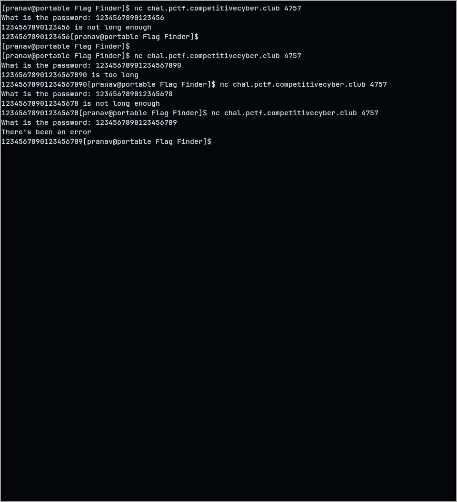
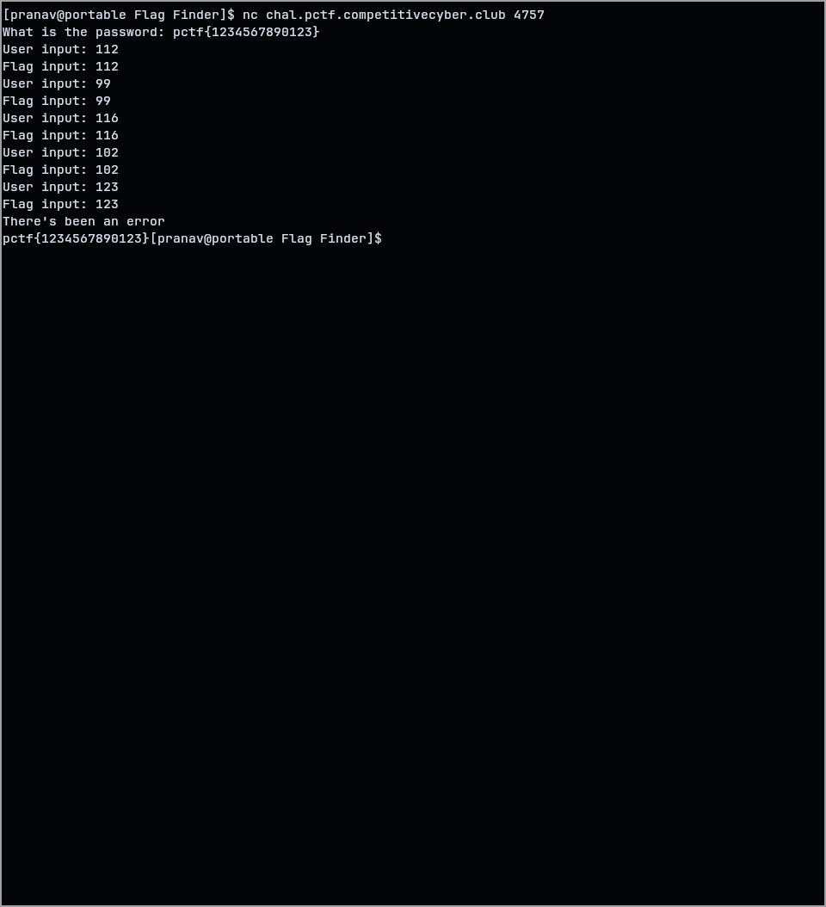

This time no attachments, just a connection, and the hosts informed that there will be bruteforce here.

Connecting to the port, it only asked for a password, and then informed if it was too high or too low.After some manual binary search, I found the length of the flag to be 19.

Now, I tried to just input the flag format, in case it informs me if those characters are right or not, and luckily it did!

^ [ When doing this in my pwntools script, I got another an extra line at the bottom with password, just like in the 1st screenshot ]
This is amazing! Now, instead of having to brute-force every single combination, I can find the characters of the password one at a time. I created a pwntools script to input the known flag with one unknown character, which I deduced was correct when an additional "User input - Flag input" pair was printed. This script just had to run till all the 19 characters are known and the flag is acquired :)

