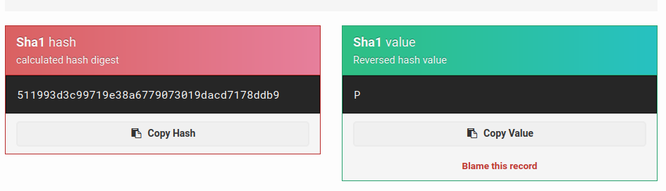
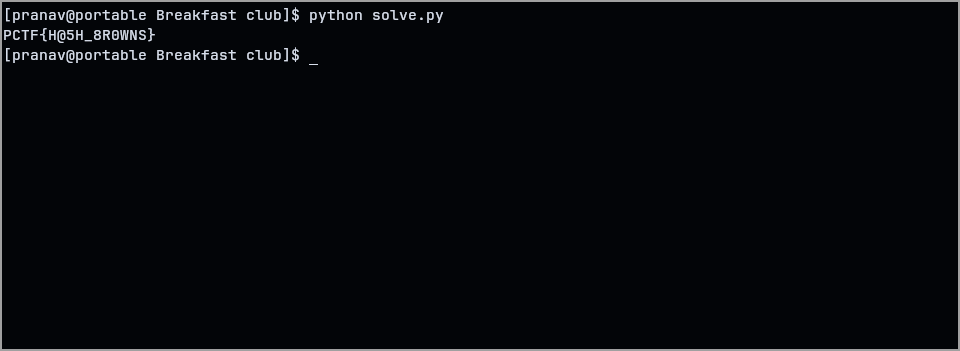

For this challenge, we were given a .txt containing the hash algorithm and the hashed text.

To explore and understand what we've been given, I decided to send the hash through a SHA1 decoder (it is really a lookup table or various known values), and to my surprise I got the value! It was 'P'.

I wondered if this may just be the first character of the flag, and so checked if the 2nd character was 'C' and it was!

So, I made a for loop to go through each alg-hash pair to: test all the alphanumeric and symbol characters, find the char that matched the hash, save that char in the flag. It's solved :D

