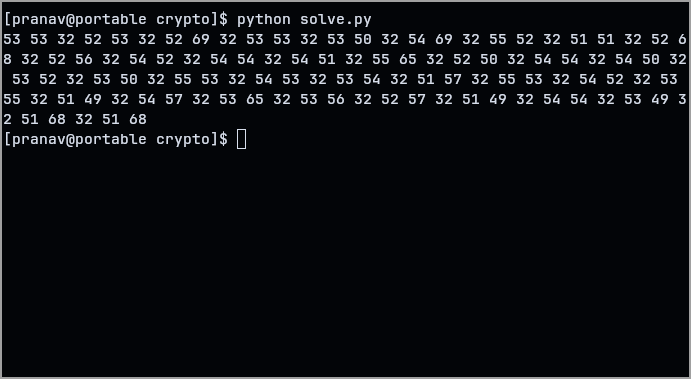
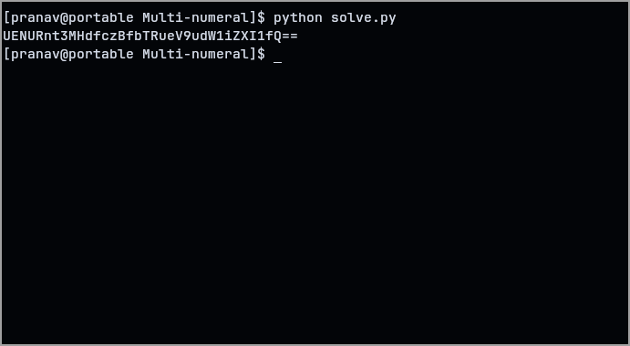
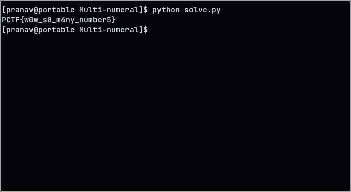

This challenge was pretty straight-forward.

Our challenge consisted of binary. On converting into a string, we got a string of ascii numbers.

Converting these ascii values to their characters gives us another set of ascii numbers, this time in hex.

Converting these values to their characters reveals a base64 text. Decoding that finally gives us the flag!

