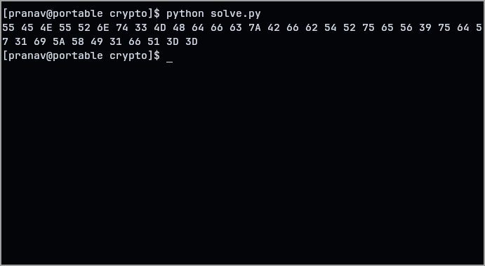

This challenge was pretty straight-forward.

Our challenge consisted of binary. On converting into a string, we got a string of ascii numbers.

Converting these ascii values to their characters gives us another set of ascii numbers, this time in hex.
This one was pretty straight forwward. The challenge file consisted of a string of 0s and 1s. On converting it into their respective characters, I got a another string this with a lot 2-digit numbers

Converting these values to their characters reveals a base64 text. Decoding that finally gives us the flag!

